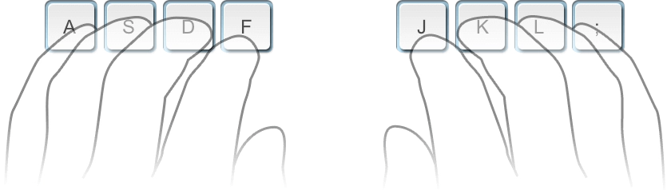
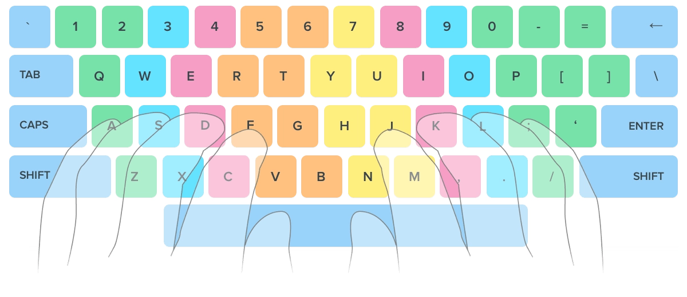

# Touch Typing

## Learn How to Touch Type

- Touch typing is all about the idea that each finger has its own area on the keyboard. Thanks to that fact you can type without looking at the keys. Practice regularly and your fingers will learn their location on the keyboard through muscle memory.

## Sitting posture for typing

- Sit straight and remember to keep your back straight.
- Keep your elbows bent at the right angle.
- Face the screen with your head slightly tilted forward.
- Keep at least 45 - 70 cm of distance between your eyes and the screen.
- Еxpose the shoulder, arm, and wrist muscles to the least possible strain. The wrists can touch the tabletop in front of the keyboard. Never shift your body weight to the wrists by resting on them.

## Home row position

- Curve your fingers a little and put them on the ASDF and JKL; keys which are located in the middle row of the letter keys. This row is called HOME ROW because you always start from these keys and always return to them.

- F and J keys under your index fingers should have a raised line on them to aid in finding these keys without looking.

## Keyboard Scheme (QWERTY)

- The color-coded keyboard under lesson input field will help you to understand which finger should press each key.
- Hit keys only with the fingers for which they have been reserved.
- Always return to the starting position of the fingers "ASDF – JKL;".
- When typing, imagine the location of the symbol on the keyboard.
- Establish and maintain a rhythm while typing. Your keystrokes should come at equal intervals.
- The SHIFT key is always pressed by the pinky finger opposite to the one hitting the other key.
- Use the thumb of whichever hand is more convenient for you to press the Space bar.
- This method may seem inconvenient at first, but do not stop, eventually, you'll find out that you are typing quickly, easily, and conveniently.

## Fingers Motion

- Don't look at the keys when you type. Just slide your fingers around until they find the home row marking.

- Limit your hand and finger movement only to what is necessary to press a specific key. Keep your hands and fingers close to the base position. This improves typing speed and reduces stress on the hands.

- Pay attention to ring fingers and little fingers, since they are considerably underdeveloped.

## Typing Speed

- Do not rush when you just started learning. Speed up only when your fingers hit the right keys out of habit.
- Take your time when typing to avoid mistakes. - The speed will pick up as you progress.
- Always scan the text a word or two in advance.
- Complete all typing lessons at Typing.com. It will help you to get above the average typing speed.

## Platforms to Learn or Practice Touch Typing
- [typing.com](https://www.typing.com/)
- [ratatype.com](https://www.ratatype.com/)
- [typeracer.com](https://play.typeracer.com/)
- [monkeytype.com](https://monkeytype.com/)
- [nitrotype.com](https://monkeytype.com/)
