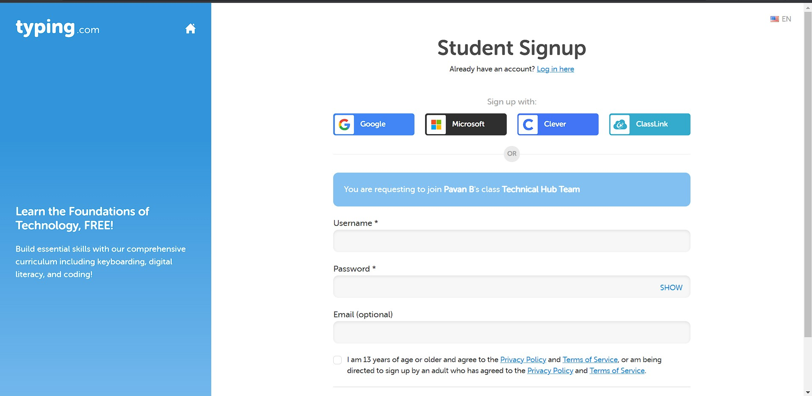
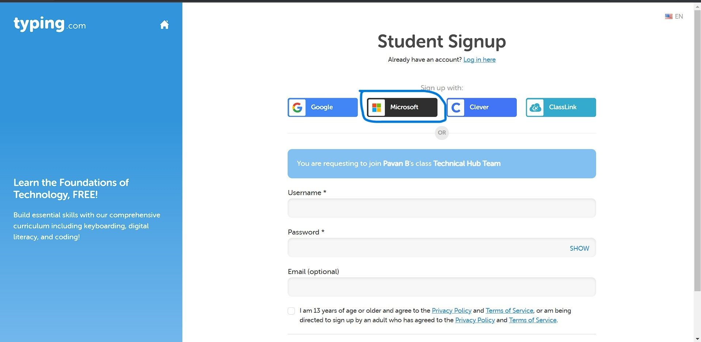
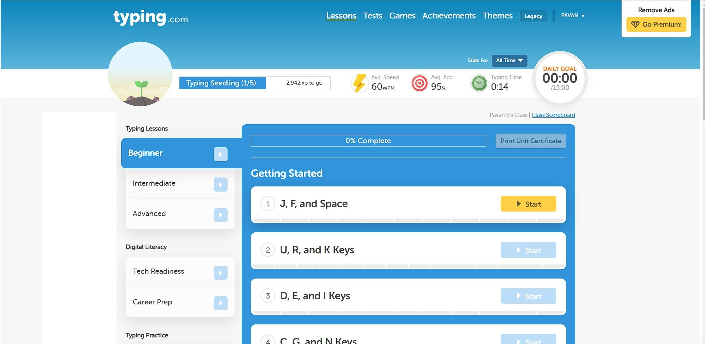

# Touch Typing

- Touch typing is a method of typing without the use of the sense of sight, or simply by feeling the keyboard. However, the sense of touch is only slightly involved since this typing method is governed by muscle memory through rigorous training with the proper typing method. This way, the fingers get so used to typing that they instinctively go to the appropriate keys without the typist needing to see or even feel around the keyboard.        - ***Source - Internet***

## Getting Started with typing.com

- Click on the below link to join the class  

- It should redirect you to the below page

- Click on Sign up with Microsoft

- Just Login Using your Microsoft Mail (Outlook - Technicalhub.io) Credentials.
 
- That should take you to **this page.**

- Pick your typing course (Beginner or Intermediate or Advanced) based on your experience and start your touch typing journey.

- **If you're a Beginner Please refer to [this markdown](https://github.com/unstoppableforce96/Touch-Typing/blob/main/touchtyping.md) for more knowledge on How to Start Touch Typing**

- You can also take some tests (1 Minute, 3 Minute or 5 Minute Tets or Page Tests) under Tests Menu.

- As you are joining the class, your progress in Touch typing can be viewed by the one who maintains the Class.

## Goal
- Is to Complete All courses in the typing.com lessons to improve the touch typing skills.
- And Is to become an average typist with a **Typing Speed of 40 - 50 words per minute with at least 90 % Accuracy.**

## Assessment

- You can take assessment that will be held by Technical Hub, whenever you feel like you are ready.
- Criterion to Pass the Assessment
  - **Minimum of 40 WPM with at least 90% Accuracy**
